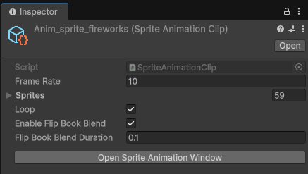
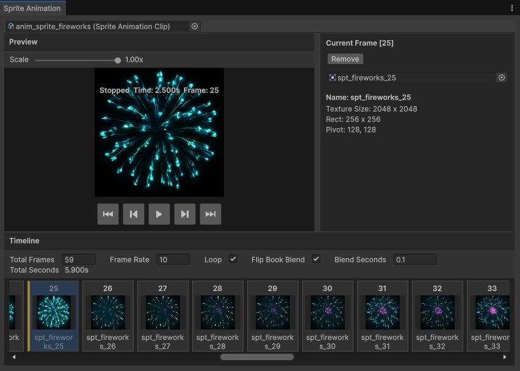
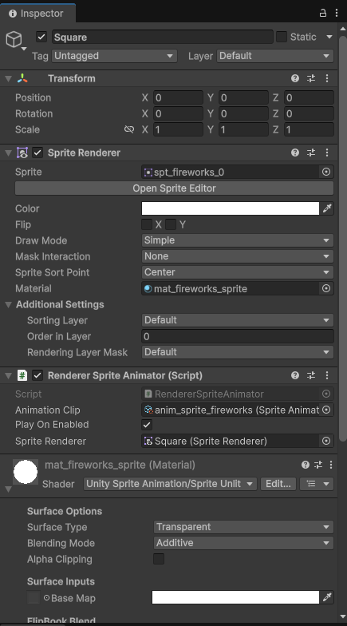
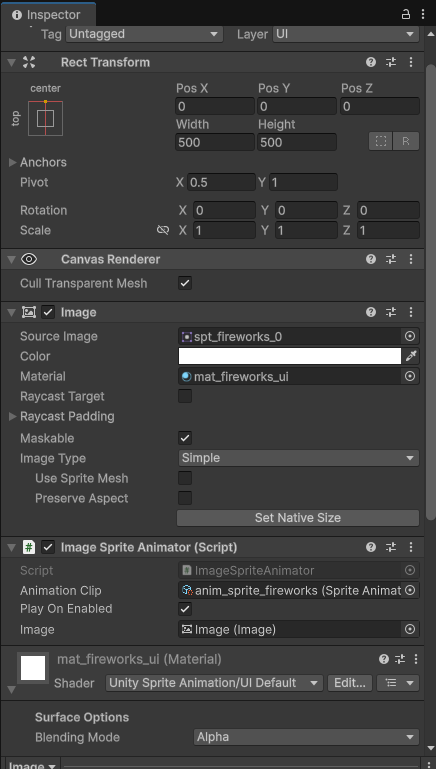
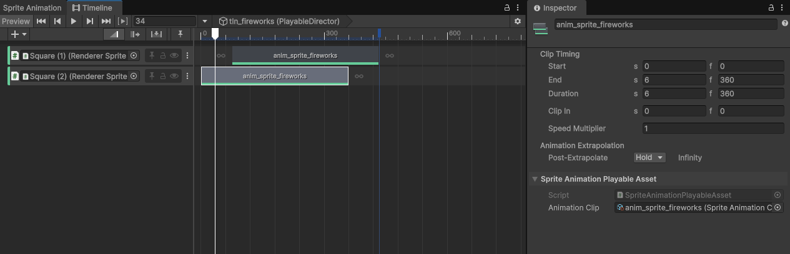

# Unity Sprite Animation

`Sprite` 配列を `SpriteAnimationClip` として管理し、`SpriteRenderer` や `UnityEngine.UI.Image` に対して手軽に再生できる Unity パッケージです。  
専用の Clip 編集ウィンドウ、FlipBookBlend 対応、Timeline 連携を含みます。


## Features

- `SpriteAnimationClip` アセットでフレーム列、Frame Rate、Loop、FlipBookBlend を管理
- `RendererSpriteAnimator` で `SpriteRenderer` を再生
- `ImageSpriteAnimator` で `UnityEngine.UI.Image` を再生
- `Window > Unity Sprite Animation > Sprite Animation Clip Editor` から専用編集ウィンドウを利用可能
- タイムライン上への `Sprite` ドラッグ & ドロップ、並べ替え、複製、コピー、貼り付け、削除に対応
- プレビュー領域で再生、コマ送り、拡大率変更が可能
- FlipBookBlend 対応 shader を使うとフレーム遷移時の補間表示に対応
- Timeline の `SpriteAnimationTrack` から `SpriteAnimator` を駆動可能

## Requirements

- Unity `6000.0` 以降

## Installation

### Install via Package Manager

1. Unity の `Window > Package Manager` を開く
2. `+` ボタンから `Add package from git URL...` を選ぶ
3. 以下を入力してインストールする

```text
https://github.com/DaitokuAmy/unity-sprite-animation.git?path=/Packages/com.daitokuamy.unityspriteanimation
```

タグ指定を行う場合は末尾にバージョンを付けます。

```text
https://github.com/DaitokuAmy/unity-sprite-animation.git?path=/Packages/com.daitokuamy.unityspriteanimation#1.0.0
```

### Install via manifest.json

`Packages/manifest.json` の `dependencies` に以下を追加します。

```json
{
  "dependencies": {
    "com.daitokuamy.unityspriteanimation": "https://github.com/DaitokuAmy/unity-sprite-animation.git?path=/Packages/com.daitokuamy.unityspriteanimation"
  }
}
```

## Quick Start

### 1. SpriteAnimationClip を作成

Project View で `Create > Unity Sprite Animation > Sprite Animation Clip` を実行し、`SpriteAnimationClip` を作成します。

`SpriteAnimationClip` では以下を設定できます。

- `Frame Rate`
- `Sprites`
- `Loop`
- `Enable FlipBookBlend`
- `FlipBookBlend Duration`

### 2. Clip にフレームを登録

作成した `SpriteAnimationClip` を選択し、Inspector の `Open Sprite Animation Window` ボタンから専用エディタを開きます。  
基本的にはこのウィンドウ上で編集しながら、フレームの追加、並べ替え、`Frame Rate`、`Loop`、`Flip Book Blend` などを設定する想定です。



### 3. Animator Component を追加

用途に応じて次のいずれかを追加します。

- `RendererSpriteAnimator`
  - 対象: `SpriteRenderer`
- `ImageSpriteAnimator`
  - 対象: `UnityEngine.UI.Image`

`Animation Clip` に作成した `SpriteAnimationClip` を指定すると、`Play On Enabled` が有効な場合は有効化時に自動再生されます。

## Runtime Usage

### SpriteRenderer で再生

```csharp
using UnityEngine;
using UnitySpriteAnimation;

public sealed class RendererSpriteAnimationExample : MonoBehaviour
{
    [SerializeField] private RendererSpriteAnimator _animator;
    [SerializeField] private SpriteAnimationClip _clip;

    private void Start()
    {
        _animator.SetAnimationClip(_clip);
        _animator.Play();
    }
}
```

### Image で再生

```csharp
using UnityEngine;
using UnitySpriteAnimation;

public sealed class ImageSpriteAnimationExample : MonoBehaviour
{
    [SerializeField] private ImageSpriteAnimator _animator;
    [SerializeField] private SpriteAnimationClip _clip;

    private void Start()
    {
        _animator.SetAnimationClip(_clip);
        _animator.Play();
    }
}
```

### Main API

`SpriteAnimator` では主に次の API を利用できます。

```csharp
public abstract class SpriteAnimator : MonoBehaviour
{
    public float TimeScale { get; set; }
    public SpriteAnimationClip AnimationClip { get; }
    public bool PlayOnEnabled { get; set; }
    public bool IsPlaying { get; }
    public float CurrentTime { get; }
    public int CurrentFrameIndex { get; }

    public void SetAnimationClip(SpriteAnimationClip clip);
    public void Play();
    public void Pause();
    public void Resume();
    public void Stop();
    public void Evaluate(SpriteAnimationClip clip, float time);
}
```

## Clip Editor

`SpriteAnimationClip` をダブルクリックするか、Inspector の `Open Sprite Animation Window` ボタンから専用エディタを開けます。  
また、Unity メニューの `Window > Unity Sprite Animation > Sprite Animation Clip Editor` からも開けます。

Clip Editor は大きく 3 つの領域で構成されています。

- `Preview`
  - 現在の再生状態を確認できます
  - 再生、停止、先頭/末尾移動、前後フレーム移動ができます
  - `Scale` で表示倍率を調整できます
- `Inspector`
  - 現在選択中のフレームに割り当てる `Sprite` を差し替えできます
  - 選択中 `Sprite` の名前、Texture Size、Rect、Pivot を確認できます
  - `Remove` で選択フレーム自体を削除できます
- `Timeline`
  - `Sprite` をドラッグ & ドロップしてフレームを追加できます
  - フレームの順序変更、複製、コピー、貼り付け、削除ができます
  - `Frame Rate`、`Loop`、`Flip Book Blend`、`Blend Seconds`、総フレーム数を編集できます

基本的な編集フローは次のようになります。

1. `SpriteAnimationClip` を開く
2. `Timeline` に `Sprite` をドラッグ & ドロップしてフレームを並べる
3. 必要に応じてドラッグで並べ替える
4. `Frame Rate` と `Loop` を調整する
5. Blend を使いたい場合は `Flip Book Blend` と `Blend Seconds` を設定する
6. `Preview` で再生確認しながら微調整する



### Editor Controls

マウス操作:

- 左クリック: フレーム選択
- ドラッグ: フレーム並べ替え
- `Sprite` のドラッグ & ドロップ: ドロップ位置へフレーム追加
- 右クリック: `Copy` / `Paste` / `Duplicate` / `Clear Sprite` / `Remove`

キー入力:

- `LeftArrow` / `RightArrow`: 選択フレームを移動
- `Delete` / `Backspace`: 選択フレームの `Sprite` をクリア
- `Space`: `Preview` の再生 / 停止をトグル
- `Copy` / `Paste` / `Duplicate`: 標準ショートカットに対応

補足:

- `Clear Sprite` はフレーム枠を残したまま `Sprite` 参照だけを外します
- `Remove` はフレーム自体を削除して後続フレームを詰めます
- `Flip Book Blend` 有効時に `Blend Seconds` が長すぎる場合は、Timeline ヘッダーに警告が表示されます

## FlipBookBlend

`SpriteAnimationClip` の `Enable FlipBookBlend` を有効にすると、フレーム遷移時に前フレームと現在フレームを補間して表示できます。  
`FlipBookBlend Duration` は 1 フレーム未満にクランプされ、長すぎる場合は Editor 上で警告が表示されます。

### Important

FlipBookBlend を実際に使うには、表示先に対応 shader を使った `Material` が必要です。  
Material が未設定でも通常のフレーム切り替え再生は可能ですが、Blend は有効になりません。

### SpriteRenderer で使う場合

`SpriteRenderer` に `Unity Sprite Animation/Sprite Unlit` を使った `Material` を設定してください。



### Image で使う場合

`Image` に `Unity Sprite Animation/UI Default` を使った `Material` を設定してください。  
`Graphic.defaultGraphicMaterial` のままでは FlipBookBlend は有効になりません。



### Provided Shaders

- `Unity Sprite Animation/Sprite Unlit`
  - `RendererSpriteAnimator` 向け
- `Unity Sprite Animation/UI Default`
  - `ImageSpriteAnimator` 向け

これらの shader には FlipBookBlend 用の runtime property が含まれており、Inspector 上では runtime 制御用として表示されます。

## Timeline

このパッケージには `SpriteAnimator` を Timeline から制御するための Track と Clip が含まれています。

- `SpriteAnimationTrack`
- `SpriteAnimationPlayableAsset`

`SpriteAnimationTrack` の binding 対象は `SpriteAnimator` です。  
そのため、`RendererSpriteAnimator` と `ImageSpriteAnimator` のどちらにも接続できます。

### Track の追加方法

1. Timeline を開く
2. `RendererSpriteAnimator` または `ImageSpriteAnimator` を持つ GameObject を用意する
3. `Add` から `SpriteAnimationTrack` を追加する
4. 追加した Track の binding に対象の `SpriteAnimator` を割り当てる

### Clip の使い方

`SpriteAnimationTrack` 上に作成される Clip は `SpriteAnimationPlayableAsset` です。  
各 Clip では再生対象の `SpriteAnimationClip` を 1 つ指定します。

- `Animation Clip`
  - 再生する `SpriteAnimationClip` を指定します
- Clip の長さ
  - 指定した `SpriteAnimationClip.Duration` が基本になります
- binding 対象
  - Track に bind した `SpriteAnimator` が再生先になります

### Behaviour

この Track は `SpriteAnimator` を外部制御して評価します。

- Track 再生中は `SpriteAnimator.Evaluate(...)` によって指定時刻のフレームを反映します
- Track が終了すると外部制御を解除し、元の状態へ戻します
- `Clip In`、`Speed Multiplier`、`Looping`、`Extrapolation` に対応します
- 最終的には weight が最も高い Clip が選択されます



## Notes

- `SpriteAnimationClip.FrameRate` は最小 `0.01` に補正されます
- `SpriteAnimationClip.Duration` は `FrameCount / FrameRate` です
- `ImageSpriteAnimator` は FlipBookBlend 用に `Material` を複製して利用します
- `RendererSpriteAnimator` も FlipBookBlend 利用時は Renderer 専用の実体 `Material` を取得して更新します
- プレビュー上の FlipBookBlend 表示は EditorWindow 用の専用描画経路を使用します

## License

This project is licensed under the MIT License. See `LICENSE.md` for details.
